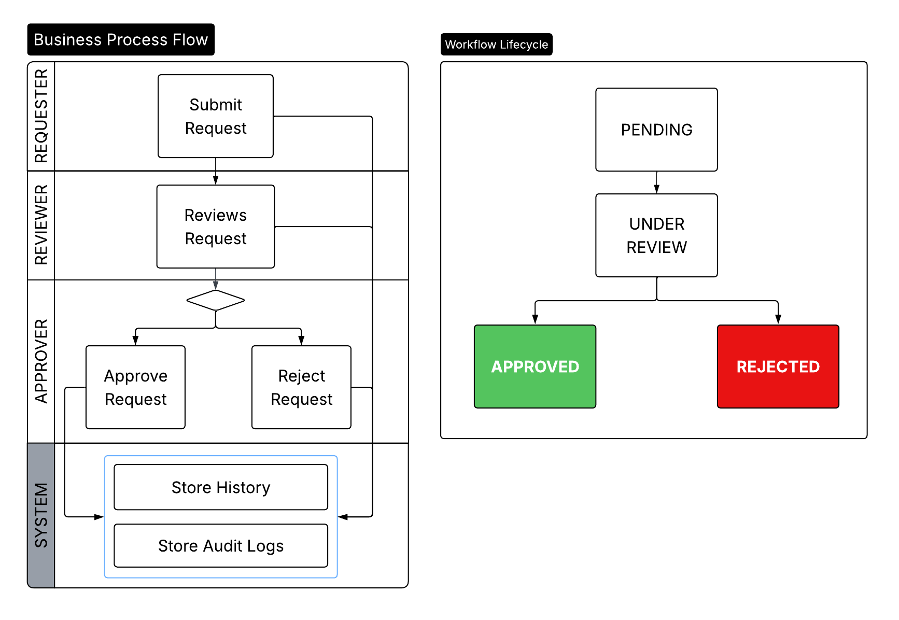
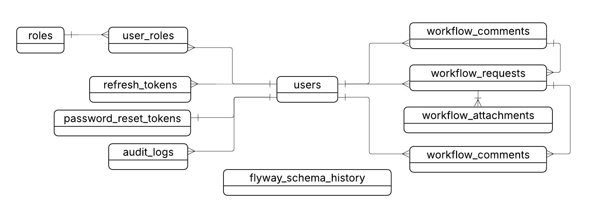
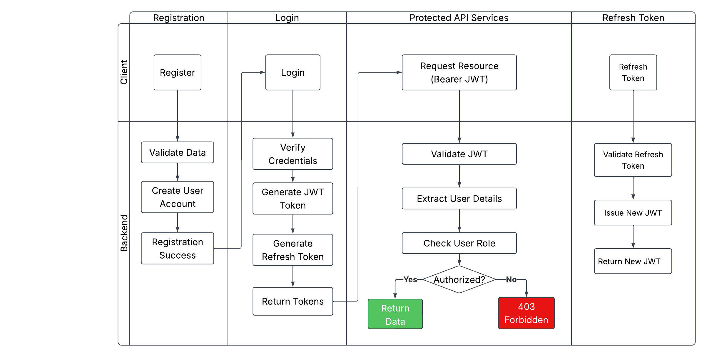
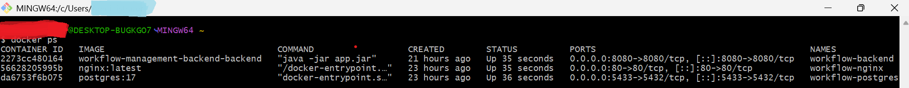

# Enterprise Workflow Management System
 
## OVERVIEW
An Enterprise Workflow Management System is an API built with Spring Boot. The system manages the complete lifecycle of workflow requests processes (submission -> review -> approval/rejection).
It demonstrates enterprise backend engineering practices. These include JWT authentication, refresh token management, role-based access control (RBAC), workflow state management, audit logging, monitoring, validation. Related to data access the system supports pagination, filtering, and search capabilities. PostgresSQL databased integrated, supports async notification and docker deployment. 
This project follows a modular monolith architecture. It exposes documented REST API using OpenAPI/Swagger.

## BUSINESS PROBLEM

Organizations often manage approval workflows manually through email, spreadsheets, or paper-based processes.

This system digitizes workflow management by providing:

- Structured approval chains
- Role-based access control
- Workflow traceability
- Audit history
- Centralized request tracking

The architecture is suitable for procurement, HR approvals, document reviews, and other enterprise workflow scenarios.

## FEATURES

### Authentication & Security
- JWT Access Token Authentication  
- Refresh Token Flow
- Logout & Token Revocation 
- Password Reset Workflow 
- BCrypt Password Hashing 
- Global Exception Handling 
- Request Validation 
- Stateless Security

### Authorization
- Role-Based Access Control (Admin, Requester, Reviewer, Approver)
- Method-Level Security 
- Endpoints Protectoin

### Workflow Management
- Submit Workflow Requests 
- Assign Reviewers 
- Assign Approvers
- Review Requests 
- Approve Requests 
- Reject Requests 
- Workflow State Validation
- Workflow Status Tracking 

### Audit & Monitoring
- Workflow History Tracking
- Audit Logging 
- Action Traceability
- Spring Boot Actuator
- Application Health Monitoring
- Application Metrics

### Search & Data Access
- Pagination
- Sorting
- Status Filtering 
- Workflow Search
- User-Specific Request Views
- File uploads

### API & Documentation
- RESTful API Design
- OpenAPI / Swagger Documentation
- Standardized API Responses 

## TECH STACK

### Backend
- Java 17
- Spring Boot
- Spring Security
- Spring Data JPA

### Database
- PostgreSQL

### API Documentation
- OpenAPI 3
- Swagger UI

### DevOps
- Docker
- Docker Compose
- NGINX
- GitHub Actions

### Build Tool
- Maven

## ARCHITECTURE
The application follows modular monolith architecture (auth, workflow, audit, file, notification). Each module is separated into controller, service, repository, dto, mapper, entity.


## WORKFLOW BUSINESS PROCESS FLOW & LIFECYCLE



## ENTITY RELATIONSHIP DIAGRAM (ERD)


## PROJECT STRUCTURE

```text
├───audit
│   ├───controller
│   ├───dto
│   ├───entitiy
│   ├───mapper
│   ├───repository
│   └───service
├───auth
│   ├───controller
│   ├───dto
│   ├───entity
│   ├───enums
│   ├───mapper
│   ├───repository
│   ├───security
│   ├───seeder
│   └───service
├───config
├───file
│   ├───controller
│   ├───dto
│   ├───entity
│   ├───repository
│   └───service
│       └───impl
├───notification
│   ├───controller
│   ├───event
│   ├───listener
│   └───service
├───shared
│   ├───exception
│   └───response
└───workflow
    ├───controller
    ├───dto
    ├───entity
    ├───enums
    ├───mapper
    ├───repository
    ├───security
    ├───service
    │   └───impl
    └───state
```

## AUTHENTICATION FLOW


## API DOCUMENTATION

```text
http://your-app-url/api/swagger-ui/index.html
```

### Swagger-ui


### Workflow Endpoints


### ApiResponse Structure and Tokens (AccessToken & RefreshToken)


### Authorization


## MONITORING

The application exposes operational endpoints using Spring Boot Actuator.

### Health
```
GET /actuator/health
```
### Application Info
```
GET /actuator/info
```
### Metrics
```
GET /actuator/metrics
```
### Loggers
```
GET /actuator/loggers
```


## DEPLOYMENT

The application is containerized using Docker.

**Components:** [Spring Boot API] [PostgreSQL] [NGINX Reverse Proxy]

**Deployment Features:** Environment Variables, Docker Compose, Health Monitoring, Logging

## LOCAL DEVELOPMENT

### Requirements
- Java 17+
- PostgreSQL
- Maven

### Clone Repository

1. git clone https://github.com/birukgebru/workflow-management-backend.git

2. cd workflow-management-backend.git

### Configure
- Copy **application-example.yml** to **application-dev.yml**
- Update database credentials and JWT secret 

### Run Application 
```
 mvn spring-boot:run
```

### Base URL

```text
http://localhost:8080
```
### Swagger
```
http://localhost:8080/swagger-ui/index.html
```

## DOCKER DEPLOYMENT

### Start Services
```
docker compose up -d
```

### Stop Services
```
docker compose down
```

### Services


- workflow-backend
- workflow-postgres
- workflow-nginx

## ENVIRONMENT VARIABLES (.env)
```
DB_URL=
DB_USERNAME=
DB_PASSWORD=

JWT_SECRET=
JWT_EXPIRATION=
JWT_REFRESH_EXPIRATION=
```
## DEMO USERS
Seed file is included to add default roles and demo users for demo. 

Password for all users: Pass123
```
ADMIN
admin@workflow.local

REQUESTER
requester@workflow.local

REVIEWER
reviewer@workflow.local

APPROVER
approver@workflow.local
```

## DEFAULT ROLES

| Role | Responsibility |
|--------|---------------|
| ADMIN | Full system access |
| REQUESTER | Submit workflow requests |
| REVIEWER | Review assigned requests |
| APPROVER | Approve or reject reviewed requests |


## ENGINEERING CONCEPTS DEMONSTRATED

- Spring Security
- JWT Authentication
- Refresh Token Strategy
- Role-Based Access Control (RBAC)
- State Machine Pattern
- Audit Logging
- DTO Mapping
- Transaction Management
- Global Exception Handling
- Pagination & Filtering
- REST API Design
- Monitoring with Actuator
- Modular Monolith Architecture
- Docker Containerization
- Docker Compose Orchestration
- NGINX Reverse Proxy
- CI/CD with GitHub Actions

## FUTURE IMPROVEMENTS

- File attachment storage (AWS S3 / MinIO)
- Email notifications via SMTP
- Elasticsearch integration


