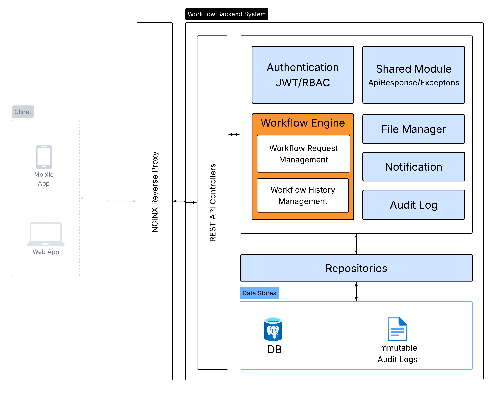
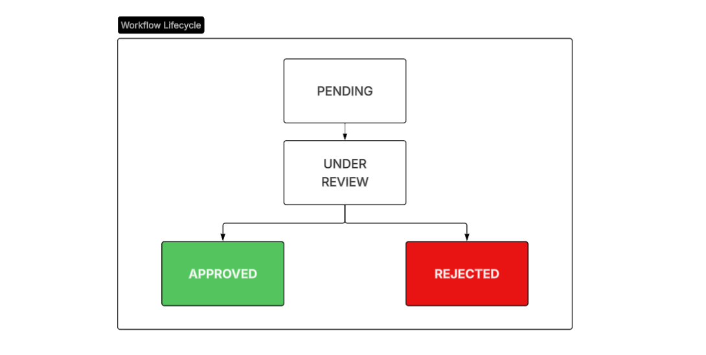
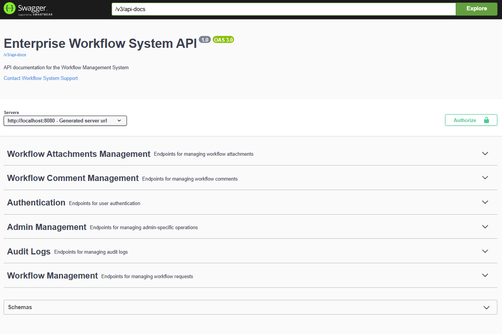
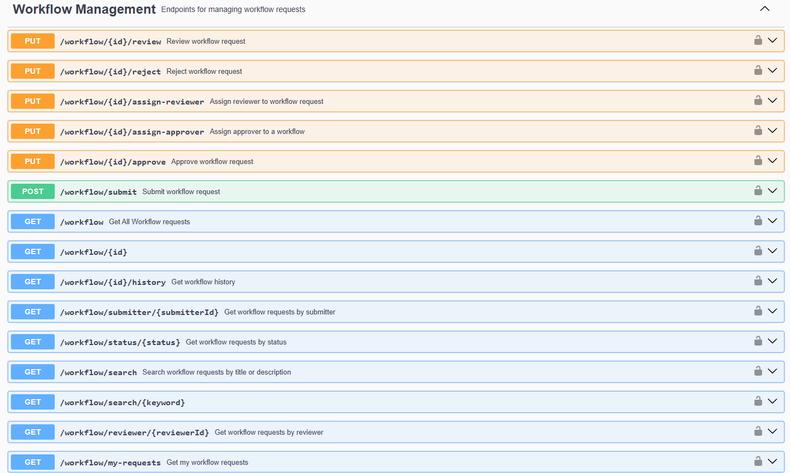
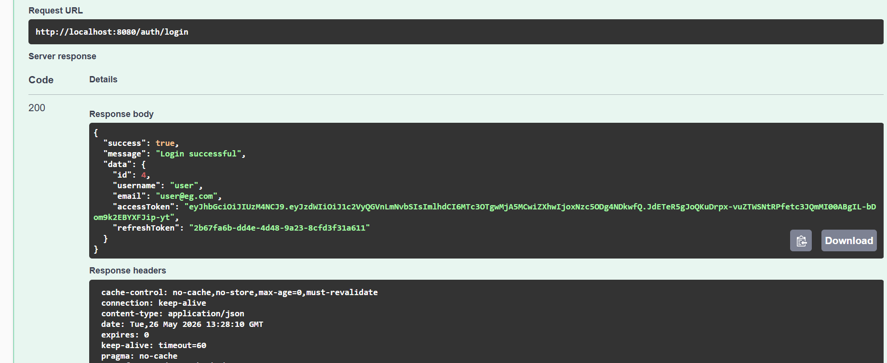
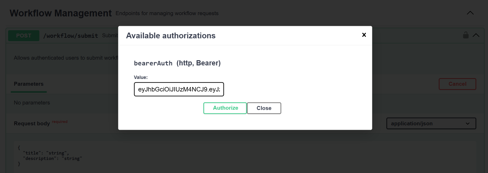

# Enterprise Workflow Management System
An Enterprise Workflow Management System is an API built with Spring Boot framework. The system manages the complete lifecycle of workflow requests processes (submission -> review -> approval/rejection).
It demonstrates enterprise backend engineering practices. These practices including JWT authentication, refresh token management, role-based access control (RBAC), workflow state management, audit logging, monitoring, validation, pagination, filtering, and search capabilities.
This project follows a modular monolith architecture. It exposes documented REST API using OpenAPI/Swagger.

## FEATURES

### Authentication & Security
```text
JWT Access Token Authentication  *  Refresh Token Flow  *  Logout & Token Revocation  *  Password Reset Workflow  *  BCrypt Password Hashing  *  Stateless Security  *  Global Exception Handling  *  Request Validation
```
### Authorization (RBAC)
```text
Role-Based Access Control (Admin, Requester, Reviewer, Approver)  *  Method-Level Security
```
### Workflow Management
```text
Submit Workflow Requests *  Assign Reviewers  *  Assign Approvers  *  Review Requests  *  Approve Requests  *  Reject Requests  *  Workflow State Validation  *  Workflow Status Tracking 
```
### Audit & Monitoring
```text
Workflow History Tracking  *  Audit Logging  *  Action Traceability  *  Spring Boot Actuator  *  Application Health Monitoring *  Application Metrics
```
### Search & Data Access
```text
Pagination  *  Sorting  *  Status Filtering  *  Workflow Search  *  User-Specific Request Views
```

### API & Documentation
```text
RESTful API Design  *  OpenAPI / Swagger Documentation  *  Standardized API Responses
```

## TECH STACK
- Java 17
- Spring Boot
- Spring Security
- Spring Data JPA
- PostgreSQL
- JWT Authentication
- Swagger/OpenAPI
- Maven

## ARCHITECTURE
The application follows layered modular monolith architecture (auth, workflow, audit, file, notification). Each module is separated into controller, service, repository, dto, mapper, entity.



## PROJECT STRUCTURE

```text
├───audit
│   ├───controller
│   ├───dto
│   ├───entitiy
│   ├───mapper
│   ├───repository
│   └───service
├───auth
│   ├───controller
│   ├───dto
│   ├───entity
│   ├───enums
│   ├───mapper
│   ├───repository
│   ├───security
│   ├───seeder
│   └───service
├───config
├───file
│   ├───controller
│   ├───dto
│   ├───entity
│   ├───repository
│   └───service
│       └───impl
├───notification
│   ├───controller
│   ├───event
│   ├───listener
│   └───service
├───shared
│   ├───exception
│   └───response
└───workflow
    ├───controller
    ├───dto
    ├───entity
    ├───enums
    ├───mapper
    ├───repository
    ├───security
    ├───service
    │   └───impl
    └───state
```

## AUTHENTICATION FLOW
1. User registers account
2. User logs in
3. JWT access token issued
4. Refresh token stored securely
5. Protected endpoints require Bearer token
6. Role-based access enforced

## WORKFLOW LIFECYCLE

## CORE ENTITITES
- User
- Role
- RefreshToken
- PasswordResetToken
- WorkflowRequest
- WorkflowHistory
- AuditLog

## SETUP INSTRUCTIONS

### Requirements
- Java 17
- PostgreSQL
- Maven

### Installations

1. git clone https://github.com/birukgebru/workflow-management-backend.git

2. cd workflow-management-backend.git

### Run Application 
- mvn spring-boot:run

### Create Database

```sql
CREATE DATABASE workflow_db;
```

### Configure Application
Copy the example configuration file:

```bash
cp src/main/resources/application-example.yml src/main/resources/application-dev.yml
```

Update the following values:

- PostgreSQL username/password
- JWT secret key

### Run Application

```bash
mvn spring-boot:run
```

### Application URL

```text
http://localhost:8080
```

## MONITORING

The application exposes operational endpoints using Spring Boot Actuator.

### Health
```
GET /actuator/health
```
### Application Info
```
GET /actuator/info
```
### Metrics
```
GET /actuator/metrics
```
### Loggers
```
GET /actuator/loggers
```
## API DOCUMENTATION

```text
http://localhost:8080/swagger-ui/index.html
```

### Swagger-ui


### Workflow Endpoints


### ApiResponse Structure and Tokens (AccessToken & RefreshToken)


### Authorization



## DEFAULT ROLES

| Role | Responsibility |
|--------|---------------|
| ADMIN | Full system access |
| REQUESTER | Submit workflow requests |
| REVIEWER | Review assigned requests |
| APPROVER | Approve or reject reviewed requests |

## ENGINEERING CONCEPTS DEMONSTRATED

- Spring Security
- JWT Authentication
- Refresh Token Strategy
- Role-Based Access Control (RBAC)
- State Machine Pattern
- Audit Logging
- DTO Mapping
- Transaction Management
- Global Exception Handling
- Pagination & Filtering
- REST API Design
- Monitoring with Actuator
- Modular Monolith Architecture

## FUTURE IMPROVEMENTS

- File attachment storage (AWS S3 / MinIO)
- Email notifications via SMTP
- Docker containerization
- Docker Compose deployment
- CI/CD pipeline
- Elasticsearch integration
- Workflow configuration engine
- Multi-tenancy support
- Kubernetes deployment 


