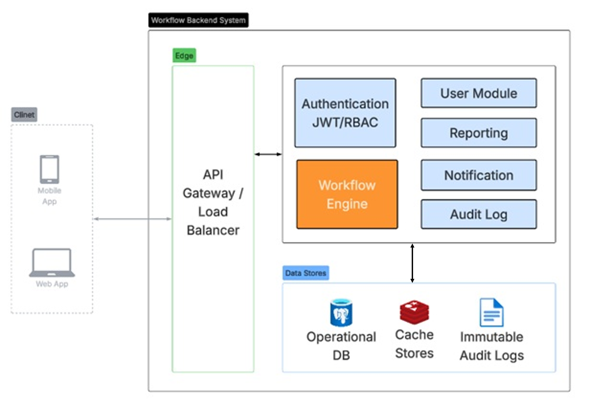

# Workflow Management System

Enterprise Workflow Management System is a backend-driven platform designed to manage approval workflows, role-based processing, audit tracking, and workflow lifecycle management.

The system demonstrates enterprise backend engineering concepts including JWT authentication, RBAC, workflow orchestration, audit logging, transactional integrity, and REST API documentation.

## FEATURES
Authentication
- JWT authentication
- Refresh token flow
- Stateless security
- Password hashing

Authorization
- RBAC
- Admin/Reviewer/Approver roles

Workflow Engine
- Submit workflow requests
- Review/Approve/Reject requests
- Workflow status tracking

Auditability
- Workflow history tracking
- Audit logs
- Action traceability

API
- RESTful API
- Swagger/OpenAPI documentation

## TECH STACK

- Java 17
- Spring Boot
- Spring Security
- Spring Data JPA
- PostgreSQL
- JWT Authentication
- Swagger/OpenAPI
- Maven
- Docker

## Architecture

The application follows layered modular monolith architecture (auth, workflow, audit, shared, config) each separated into controller, service, repository, dto, mapper, entity.

